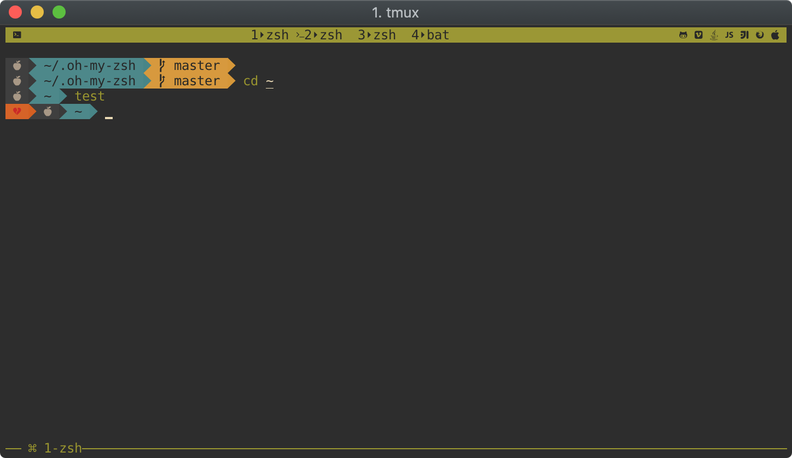

# gruvbox-zsh
A Gruvbox Theme for zsh. Original color scheme for Vim could be found [Gruvbox](https://github.com/morhetz/gruvbox).
The ZSH theme based on [agnoster's Theme](https://gist.github.com/agnoster/3712874).


# Installation
1. Download and install a [Nerd Font](https://nerdfonts.com/).
2. Download `gruvbox.zsh-theme` and put it in `~/.oh-my-zsh/custom/themes/`.
  ``` bash
  curl -L https://raw.githubusercontent.com/sbugzu/gruvbox-zsh/master/gruvbox.zsh-theme > ~/.oh-my-zsh/custom/themes/gruvbox.zsh-theme
  ```
3. Enable the theme, add the following to your `~/.zshrc` or `~/.oh-my-zsh/custom/custom.zsh` file
  ```
  ZSH_THEME="gruvbox"
  SOLARIZED_THEME="dark"
  ```
